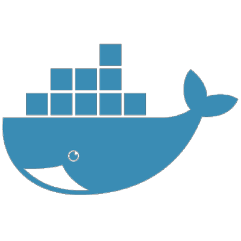
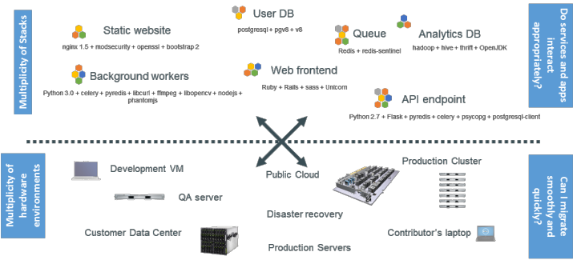
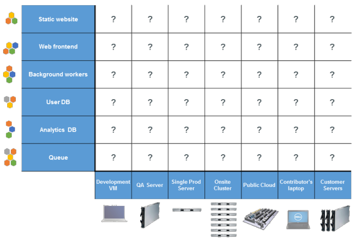
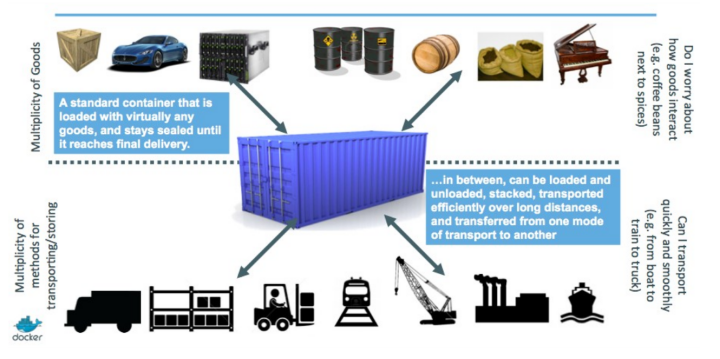
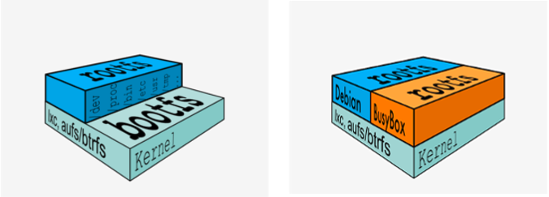
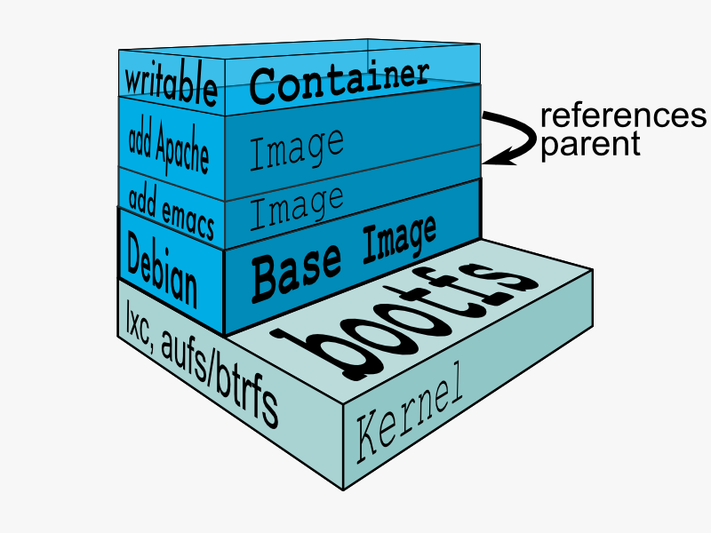

name: inverse
layout: true
class: center, middle, inverse

---

## Basic Docker Introduction

####An Open Platform to Build, Ship, and Run Distributed Applications

---
layout: false
## Why everybody talk about containers?

- The software industry change
	- Before
		- monolithic application
		- log development cycles
		- single environment
		- slowly scaling up

	- Now
		- decoupled services
		- fast, iterative improvement
		- multiple environment
		- quickly scaling out

---
## Challenge



---
## Deployment Matrix



---
## Compare Containers and VMs


---
## Intermodal shipping containers



---
## Docker Architecture

- Docker Daemon
  	- The Docker daemon runs on a host machine. The user does not directly interact with the daemon, but instead through the Docker client (or API)

- The Docker client
	- The Docker client, in the form of the docker binary, is the primary user interface to Docker. It accepts commands from the user and communicates back and forth with a Docker daemon
---
## bootfs and rootfs

A typical Linux start to run to two FS - bootfs + rootfs 
- bootfs (boot file system) Including bootloader and kernel
	- bootloader is the main kernel boot loader,
	- cgroups, namespace, device mapper
- different Linux distributions, the bootfs is basically the same, the rootfs will be different
 

---
## Container images



---
## Container images


---

layout: false
## Install Docker from source

```bash
sudo dnf remove docker
curl -fsSL https://get.docker.com/ | sh
sudo usermod -aG docker admin
su - admin
sudo systemctl start docker
sudo systemctl enable docker

docker version

Client:
 Version:      1.12.1
 API version:  1.24
 Go version:   go1.6.3
 Git commit:   23cf638
 Built:        
 OS/Arch:      linux/amd64

Server:
 Version:      1.12.1
 API version:  1.24
 Go version:   go1.6.3
 Git commit:   23cf638
 Built:        
 OS/Arch:      linux/amd64


```

---
## Lab Docker 1
### Run Command
```bash
docker ps
docker images
docker images ubuntu
docker run -it ubuntu /bin/bash
docker run -it ubuntu echo "Hello World"
docker run -it -e FOO=bar ubuntu /bin/bash
docker images
docker ps -a

docker run --name ubuntu_test -it ubuntu /bin/bash
docker start ubuntu_test
docker attach ubuntu_test
docker ps
docker exec -it ubuntu_test /bin/bash

docker pull centos
```
<!--
note
- explain pull image from remote if not exist on local
- root@68c2f9240db9:/#  ps faux
- dpkg -l | wc -l
- docker search django
-->
---
## Enjoy flglet

```bash

docker run -it ubuntu /bin/bash
root@202b4ce1a87c:/# apt-get update -y
root@202b4ce1a87c:/# apt-get install figlet
root@202b4ce1a87c:/# figlet  hello
 _          _ _       
 | |__   ___| | | ___  
 | '_ \ / _ \ | |/ _ \ 
 | | | |  __/ | | (_) |
 |_| |_|\___|_|_|\___/ 

root@202b4ce1a87c:/# exit
## start new
docker run -it ubuntu /bin/bash
figlet hello

```
- Difference between VM and container image (alway new from image)
- Have to create image from container link snapshot
---
## Lab Docker 2
### Run Command

```bash
mkdir -p ~/labdocker1/www && cd ~/labdocker1/www
touch index.html
echo "Hi from Lab Docker 1" > index.html
docker run -d php:5.6-apache
docker run --name web1 -v ~/labdocker1/www:/var/www/html -d -p 80 php:5.6-apache
docker ps


docker run --name web2 -v ~/labdocker1/www:/var/www/html -d -p 8080:80 php:5.6-apache

```
---
## Convert install.sh to Dockerfiles
### Basic process
1. Write Dockerfiles for your application
2. prepare images from docker hub
3. Describe stack application with Composefile
4. rum command

```bash
git clone 
docker-compose up
```
###Install compose
```base
$ sudo su -
(copy all in online)
# curl -L https://github.com/docker/compose/releases/download/1.8.0/docker-compose-`uname -s`-`uname -m` > /usr/local/bin/docker-compose
# chmod +x /usr/local/bin/docker-compose

```
---
### Lab Docker 3
[lab Docker 3 file](./dockerlab3/)

```bash
$ tree 
.
├── app.py
├── docker-compose.yml
├── Dockerfile
└── requirements.txt
```
### build and run application

```bash
docker build -t web .
docker-compose up
open browser **http://0.0.0.0:5000/** and hit refresh
```
- ref https://docs.docker.com/compose/install/
- ref https://docs.docker.com/compose/gettingstarted/

---
