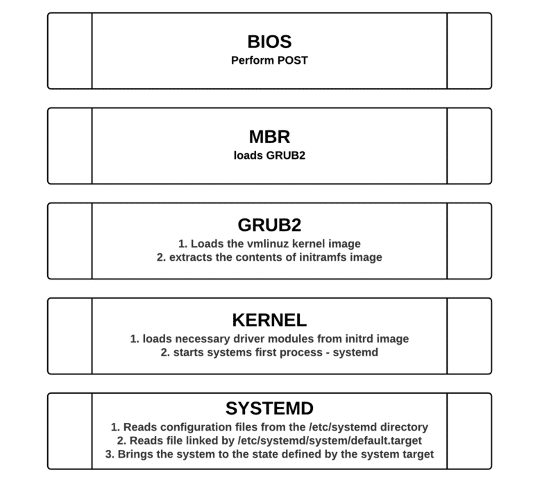

name: inverse
layout: true
class: center, middle, inverse
---
## Basic Linux for Openstack
---
layout: false
## Booting process

.footnote[Go back to [main menu](../index.html)]
---
##1. BIOS (or firmware phase)
- The BIOS (Basic Input/Output System), performs the POST (power on self test) to detect, test and initialize system hardware components
- Loads the MBR (Master boot record).
.footnote[Go back to [main menu](../index.html)]
---
##2. Master boot record (MBR)
- Master Boot Record (MBR) is the first 512 bytes of the boot drive that is read into memory by the BIOS.
- The next 64 bytes contain the partition table for the disk. The last two bytes are the “Magic Number” which is used for error detection.


.footnote[Go back to [main menu](../index.html)]
---
##3. GRUB2 Bootloader
- The default bootloader program used on RHEL 7 is GRUB 2. GRUB stands for GRand Unified Bootloader. GRUB 2 replaces the older GRUB bootloader also called as legacy GRUB.
- The GRUB 2 configuration file is located at /boot/grub2/grub.cfg (Do not edit this file directly).
- GRUB 2 menu-configuration settings are taken from /etc/default/grub when generating grub.cfg.
- Sample /etc/default/grub file :

```bash
# cat /etc/default/grub

 GRUB_TIMEOUT=5
 GRUB_DISTRIBUTOR="$(sed 's, release .*$,,g' /etc/system-release)"
 GRUB_DEFAULT=saved
 GRUB_DISABLE_SUBMENU=true
 GRUB_TERMINAL_OUTPUT="console"
 GRUB_CMDLINE_LINUX="rd.lvm.lv=fedora/swap rhgb quiet"
 GRUB_DISABLE_RECOVERY="true"

# grub2-mkconfig –o /boot/grub2/grub.cfg


```
.footnote[Go back to [main menu](../index.html)]
---
## initramfs

- The job of the initial RAM file system is to preload the block device modules, such as for IDE, SCSI, or RAID, so that the root file system, on which those modules normally reside, can then be accessed and mounted
- The initramfs is bound to the kernel and the kernel mounts this initramfs as part of a two-stage boot process
- The dracut utility creates initramfs whenever a new kernel is installed.
- Use the lsinitrd command to view the contents of the image created by dracut:

```bash
# lsinitrd
```
.footnote[Go back to [main menu](../index.html)]
---
##4. Kernel
- The kernel starts the systemd process with a process ID of 1 (PID 1).
```bash
$ pstree
$ ps -aux | grep systemd
root         1  0.0  0.0 197108  9464 ?        Ss   19:00   0:02 /usr/lib/systemd/systemd --switched-root --system --deserialize 22
```
.footnote[Go back to [main menu](../index.html)]
---
##5. systemd -> Systemd is a new init system
- systemd is the ancestor of all processes on a system
- Speeds up booting by loading services concurrently
- Allows you to manage various types of units on a system
  - services (name.service)
  - targets (name.target)
  - devices (name.device)
  - file system mount points (name.mount)
  - sockets (name.socket)
- Snapshotting of the system state and restoration of the system state from a snapshot is supported.
.footnote[Go back to [main menu](../index.html)]
---
## systemd unit types

---
## Parallel process boot

---
## systemd configuration files

- /usr/lib/systemd/system
  - systemd units distributed with installed RPM packages

- /run/systemd/system
  - systemd units created at runtime. This directory takes precedence over the directory with installed service units

- /etc/systemd/system
  - systemd units created and managed by the system administrator. This directory takes precedence over the directory with runtime units.
.footnote[Go back to [main menu](../index.html)]
---
## Systemd workshop
- Systemd's structure

---
## Systemd command
- start and stop service

```bash
sudo systemctl start application.service
--or--
sudo systemctl start application

sudo systemctl stop application.service
sudo systemctl restart application.service

sudo systemctl reload application.service
sudo systemctl reload-or-restart application.service

sudo systemctl enable application.service
sudo systemctl disable application.service

systemctl status application.service
systemctl is-active application.service
systemctl is-enabled application.service
systemctl is-failed application.service

systemctl mask nginx.service
systemctl unmask nginx.service

```
.footnote[Go back to [main menu](../index.html)]
---
## Systemd command
- System overview

```bash
##only active
systemctl list-units

##all
systemctl list-units --all

systemctl list-units --all --state=inactive

systemctl list-units --type=service

```
.footnote[Go back to [main menu](../index.html)]
---
## Display unit files
To display the unit file that systemd has loaded into its system

```bash
systemctl cat atd.service

# /usr/lib/systemd/system/atd.service
[Unit]
Description=Job spooling tools
After=syslog.target systemd-user-sessions.service

[Service]
EnvironmentFile=/etc/sysconfig/atd
ExecStart=/usr/sbin/atd -f $OPTS

[Install]
WantedBy=multi-user.target

```
.footnote[Go back to [main menu](../index.html)]
---
## Displaying Dependencies
To see a unit's dependency tree, you can use the list-dependencies command:

```bash
systemctl list-dependencies sshd.service

sshd.service
● ├─system.slice
● ├─sshd-keygen.target
● │ ├─sshd-keygen@ecdsa.service
● │ ├─sshd-keygen@ed25519.service
● │ └─sshd-keygen@rsa.service
● ├─sshd-keygen.target
● │ ├─sshd-keygen@ecdsa.service
● │ ├─sshd-keygen@ed25519.service
● │ └─sshd-keygen@rsa.service
...
```
.footnote[Go back to [main menu](../index.html)]
---
## Checking Unit properties
To see the low-level properties of a unit, This will display a list of properties that are set for the specified unit using a key=value format:

```bash
systemctl show sshd.service

Type=forking
Restart=on-failure
PIDFile=/var/run/sshd.pid
NotifyAccess=none
RestartUSec=42s
TimeoutStartUSec=1min 30s
TimeoutStopUSec=1min 30s
RuntimeMaxUSec=infinity
WatchdogUSec=0
WatchdogTimestampMonotonic=0
FailureAction=none
...
```
.footnote[Go back to [main menu](../index.html)]
---
## Lab nginx
### start centos 7 instance with vagrant

- install nginx
- start/stop service
- verify status
- mask service and try to start

```bash
yum install epel-release
yum install nginx

systemctl start nginx
systemctl stop nginx
systemctl mask nginx
systemctl start nginx
```
.footnote[Go back to [main menu](../index.html)]
---
## Add and Delete User
### command

```bash
##root privileges
adduser username
##sudo
adduser username
passwd username
##Granting Sudo Privileges to a User
gpasswd -a username wheel
#Delete
userdel username
userdel -r username

```
## Check ip address
### ip command (iproute package

  )
.footnote[Go back to [main menu](../index.html)]
---

.footnote[Go back to [main menu](../index.html)]
---

.footnote[Go back to [main menu](../index.html)]
---

.footnote[Go back to [main menu](../index.html)]
---

.footnote[Go back to [main menu](../index.html)]
---
