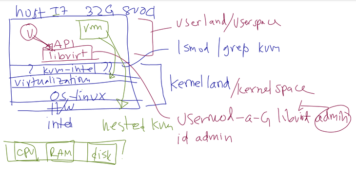
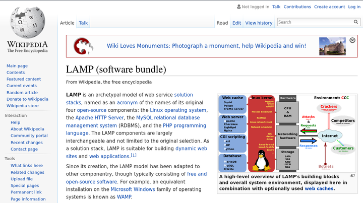
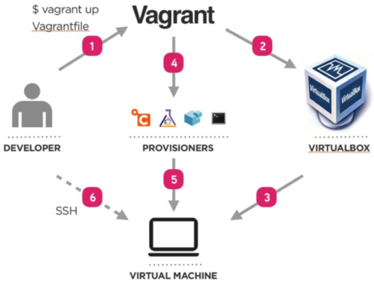

name: inverse
layout: true
class: center, middle, inverse
---
## Preparation
- Install Fedora 24
  - (Remaster Developemt Tool + Thai + multimedia)
- Install package
- Install Vagrant
- Install Docker
---
layout: false
## Install Fedora 24 with usb
- boot to BIOS
  - enable boot from usb
  - enable virtualization

- After boot from usb  choose 'linux0' then press enter
```bash
boot: linux0
```
- system will boot to liveUSB
- choose install
- Watch LiveDemo, install together Good luck
---
## Get Documents
### Documents available on github
- Register github.com
  - github.com
- Generate ssh key

```bash
$ ssh-keygen -t rsa
(no passphase)
ls ~/.ssh/
id_rsa  id_rsa.pub  known_hosts
cat ~/.ssh/id_rsa.pub

ssh-rsa AAAAB3NzaC1yc2EAAAADAQABAAABAQDFVazRu/snNb4RpiVwn+2dE+3yFaLk4gYGTvKFaLy/EOyaJwpLbKIbycPFUdUktiJXTQ3G1YdiQG29xbvBpQnfTKouOK93qjCaSRTKJCjV2vCldjby4qrYcG9l4a4Ush1fDFXNl61bEdIbRI9lyZv/eV3pmBiJjPu8OL/ulN+SaUJ3UBKVj1rjJy016fT5AefiiHVs7fqMwmhb3RJgCOQ6WWi3A6qXI+/7G4GNsw5CNxv+Nrw95TX6LD54kioNDb3VSaIwhNfbnQ0ZcfEPmFBR6sDX7Rmyrs7uWkEfQDD4CtLCbfjHACNoHr4bcbRprPXUkpuFIapEyuRqDYPY7fXh admin@localhost.localdomain

cd ~
git clone https://github.com/itbakery/training
cd training
firefox index.html

```
---
## Install Basic
become root
```bash
## check user admin
id admin
uid=1000(admin) gid=1000(admin) groups=1000(admin),10(wheel)

sudo grep admin /etc/sudoers
admin ALL=(ALL)  ALL

grep admin /etc/passwd
admin:x:1000:1000:admin:/home/admin:/bin/bash

## change to root
sudo su -
```
---
# user file
```bash
$ grep admin /etc/group
wheel:x:10:admin
libvirt:x:985:admin
admin:x:1000:
docker:x:974:admin

$ grep admin /etc/shadow
grep: /etc/shadow: Permission denied

$ sudo grep admin /etc/shadow
[sudo] password for admin:

admin:$6$0H7zn1eUat3oCwhM$zJneG.ouMp992r/kIvkOJdO8k.kozrNJUXmxF7zdw8SSzXQHYHvsZXHldpTIGwJahelNZreY0pqkHZdtnuhO3.::0:99999:7:::

```
---
#Install packages
- dnf -> packages management
- repo ->  /etc/yum.repos.d/

```bash
## repo
ls /etc/yum.repos.d/
## dnf command
dnf repolist
dnf grouplist
dnf groupinstall "Development Tools"
dnf update -y
dnf install -y thai-* google-noto-sans-thai-fonts.noarch google-noto-serif-thai-fonts.noarch
dnf install -y git git-cola
dnf install -y ruby ruby-devel libxml2
dnf install -y vagrant vagrant-libvirt
```
.footnote[Go back to [main menu](../index.html)]
---
## install virtualization

```bash
dnf install -y @virtualization
dnf -y install qemu-kvm libvirt virt-install bridge-utils
systemctl start libvirtd
systemctl enable libvirtd

usermod -a -G libvirt admin

##verify
lsmod | grep kvm

## enable nested kvm kernel option
vi /etc/modprobe.d/kvm.conf
## uncomment
options kvm_intel nested=1

reboot
## after reboot verify by
cat /sys/module/kvm_intel/parameters/nested
Y
```
.footnote[Go back to [main menu](../index.html)]
---
##Diagram

---
##install chrome
manually add repo to /etc/yum.repos.d/

```bash
cat << EOF > /etc/yum.repos.d/google-chrome.repo
[google-chrome]
name=google-chrome - \$basearch
baseurl=http://dl.google.com/linux/chrome/rpm/stable/\$basearch
enabled=1
gpgcheck=1
gpgkey=https://dl-ssl.google.com/linux/linux_signing_key.pub
EOF

dnf repolist

dnf install -y google-chrome-stable
```

.footnote[Go back to [main menu](../index.html)]
---
## Install NTP

```bash
timedatectl list-timezones
sudo timedatectl set-timezone Asia/Bangkok
yum install ntp
sudo ntpdate pool.ntp.org

sudo vi /etc/ntp.conf


```


.footnote[Go back to [main menu](../index.html)]
---
##Install virtualbox with extenstion pack
Add virtualbox from repo

```bash
cd /etc/yum.repos.d/
wget http://download.virtualbox.org/virtualbox/rpm/fedora/virtualbox.repo
dnf update -y
dnf install -y binutils gcc make patch libgomp glibc-headers glibc-devel kernel-headers kernel-devel dkms
dnf install -y VirtualBox-5.1
wget http://download.virtualbox.org/virtualbox/5.1.6/Oracle_VM_VirtualBox_Extension_Pack-5.1.6-110634.vbox-extpack
mv Oracle_VM_VirtualBox_Extension_Pack-5.1.6-110634.vbox-extpack  /home/admin/Downloads/
## open filebrower and double click
```

.footnote[Go back to [main menu](../index.html)]
---
##install docker suit from source
- install docker 1.12
- install docker-machine
- install docker-compose

```bash
## docker
sudo dnf remove docker
curl -fsSL https://get.docker.com/ | sh
sudo usermod -aG docker admin
sudo systemctl start docker
sudo systemctl enable docker
## docker machine
sudo su -
curl -L https://github.com/docker/machine/releases/download/v0.7.0/docker-machine-`uname -s`-`uname -m` > /usr/local/bin/docker-machine && \
chmod +x /usr/local/bin/docker-machine

## docker compose
sudo su -
curl -L https://github.com/docker/compose/releases/download/1.8.0/docker-compose-`uname -s`-`uname -m` > /usr/local/bin/docker-compose
chmod +x /usr/local/bin/docker-compose

##work on admin user
docker-machine create -d virtualbox dev1
```
.footnote[Go back to [main menu](../index.html)]
---
## Understand how vagrant help to build infra.


.footnote[Go back to [main menu](../index.html)]
---
## Vagrant Workflow
- [Vagrant project](https://www.vagrantup.com/)
- [Vagrant repo](ttps://atlas.hashicorp.com/boxes/search)



.footnote[Go back to [main menu](../index.html)]
---
## Workshop LAMP
### Ansible to Provision Vagrant Boxs

```bash
sudo dnf install ansible vagrant vagrant-libvirt

mkdir -p ~/vagrant/lampbox  && cd ~/vagrant/lampbox
vagrant init centos/7
vi Vagrantfile

config.vm.network "forwarded_port", guest: 80, host: 8080
config.vm.provision :ansible do |ansible|
  ansible.playbook = "lamp.yml"
end

vagrant up --provider libvirt
```

.footnote[Go back to [main menu](../index.html)]
---

## lamp.yml
right click [lamp.yml](./lamp.yml) and save to '~/vagrant/lampbox'

```bash
---
- hosts: all
  become: yes
  become_user: root
  tasks:
  - name: Install Apache
    yum: name=httpd state=latest
  - name: Install MariaDB
    yum: name=mariadb-server state=latest
  - name: Install PHP5
    yum: name=php state=latest
  - name: Start the Apache server
    service: name=httpd state=started
  - name: Install firewalld
    yum: name=firewalld state=latest
  - name: Start firewalld
    service: name=firewalld state=started
  - name: Open firewall
    command: firewall-cmd --add-service=http --permanent
```
.footnote[Go back to [main menu](../index.html)]
---
