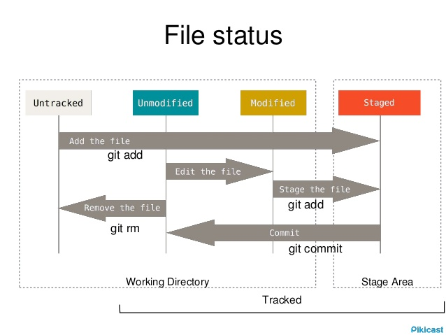

name: inverse
layout: true
class: center, middle, inverse

---
## Vagrant

---
layout: false
## What is Vagrant
- command line to create virtual machine
- support libvirt / virtualbox
- can run provision :  shell script , ansible , chef, Puppet


---
## Basic git
```bash
mkdir  ~/git1  && cd ~/git1
git1]$ git init .
Initialized empty Git repository in /home/admin/git1/.git/
ls -a
git1]$ git config --global user.name "sawangpong muadphet"
git1]$ git config --global user.email sawangpong@example.com

git1]$ touch file1.txt
git1]$ git status
On branch master
Initial commit
Untracked files:
  (use "git add <file>..." to include in what will be committed)
	file1.txt
nothing added to commit but untracked files present (use "git add" to track)

```
---
## git add
```bash
git1]$ git add file1.txt
```
---
## Git state

---
## Git tree


---
## online tutorial
- https://try.github.io/levels/1/challenges/1
- https://onlywei.github.io/explain-git-with-d3/
---
## How to use
- Create Project directory
- Create Vagrantfile inside project folder
- Choose images  link centos/7

```base
cd ~  && pwd
/home/admin
mkdir vagrant1
cd vagrant1
vagrant init centos/7
vagrant up --provider libvirt
vagrant ssh
[vagrant@localhost ~]$ id
uid=1000(vagrant) gid=1000(vagrant) groups=1000(vagrant) context=unconfined_u:unconfined_r:unconfined_t:s0-s0:c0.c1023
[vagrant@localhost ~]$ ip a
```
---
## Understand network
- ip command
  - ip a
  - ip a s eth0
- service NetworkManager vs network
  - service start/stop NetworkManager
  - service start/stop network

```bash
ip a
ip addr show eth0 | grep "inet\b" | awk '{print $2}' | cut -d/ -f1
ip r
```
- ip addr show eth0 shows information about eth0
- grep "inet\b" only shows the line that has the IPv4 address (if you wanted the IPv6 address, change it to "inet6\b")
- awk '{print $2}' prints on the second field, which has the ipaddress/mask, example 172.20.20.15/25
- cut -d/ -f1 only takes the IP address portion.

---
## up and down interface

```bash
nmcli con up System\ eth0

```
---
## Static ip and DHCP
- vm get ip from dhcp server on network
- change dhcp to static with nmcli command
- compare /etc/sysconfig/network-scripts/ifcfg-eth0

```bash
cat /etc/sysconfig/network-scripts/ifcfg-eth0
nmcli con show
NAME         UUID                                  TYPE            DEVICE
System eth0  5fb06bd0-0bb0-7ffb-45f1-d6edd65f3e03  802-3-ethernet  eth0
nmcli con show 5fb06bd0-0bb0-7ffb-45f1-d6edd65f3e03
nmcli dev status

sudo nmcli con mod System\ eth0 ipv4.addresses 192.168.121.239/24
sudo nmcli con mod System\ eth0 ipv4.gateway 192.168.121.1
sudo nmcli con mod System\ eth0 ipv4.method manual

/etc/sysconfig/network-scripts/ifcfg-eth0

ip a
```
** try to use tap tap
---
